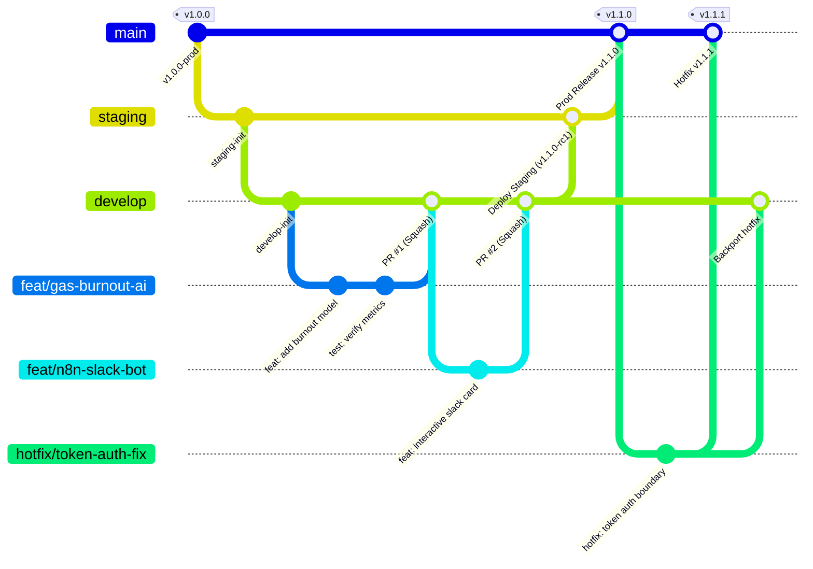

# Questo Enterprise — Git Branching, Release Strategy & Engineering Standards

> **Standard Version**: 2.0.0-PROD  
> **Repository**: [https://github.com/Atofinite5/QuestO](https://github.com/Atofinite5/QuestO)  
> **Model**: Scaled Trunk-Based Development with Environment Promotion  

---

## 1. Executive Branch Topology



---

## 2. Permanent Branch Hierarchy & Protection Rules

| Branch | Role | Environment | Merge Policy | Protection Rules |
|---|---|---|---|---|
| **`main`** | Production release branch | Production Google Workspace + Prod n8n instance | PR only from `staging` (or `hotfix/*`) | • Requires 2 approvals<br>• Required CI checks passing<br>• Enforce semantic release tags (`vX.Y.Z`)<br>• Strictly NO direct push |
| **`staging`** | Pre-production testing | Staging Google Sheet + Staging n8n server | PR only from `develop` | • Required CI checks passing<br>• 1 approval required |
| **`develop`** | Integration branch | Dev workspace | PR from `feat/*`, `fix/*`, `refactor/*` | • Automated linter / syntax checks pass<br>• 1 review required |

---

## 3. Ephemeral Branch Naming Standards

All temporary branches created by engineers, agents, or leads MUST adhere to this convention:

```text
<type>/<scope>-<short-description>
```

### Allowed Types:
- `feat/` — New features, services, or workflow triggers (e.g. `feat/gas-burnout-card`, `feat/n8n-slack-interactive`)
- `fix/` — Bug fixes during normal dev cycle (e.g. `fix/streak-freeze-timezone`, `fix/gas-cwe1236-sanitize`)
- `hotfix/` — Urgent production patches branched directly off `main` (e.g. `hotfix/webhook-auth-header`)
- `chore/` — Dependency upgrades, CI/CD tweaks (e.g. `chore/github-actions-ci`, `chore/npm-deps`)
- `docs/` — Documentation updates (e.g. `docs/update-architecture-v2`)
- `test/` — Adding verification test cases (e.g. `test/rubric-e2e-scenarios`)

---

## 4. Commit Message Standard: Conventional Commits

Every commit message must follow the [Conventional Commits v1.0.0](https://www.conventionalcommits.org/) spec:

```text
<type>(<scope>): <short imperative summary>

[optional body explaining WHY, not just WHAT]

[optional footer, e.g. Closes #12, CVE-1236]
```

### Examples:
- `feat(gas): implement quadratic level calculation in GamificationService`
- `fix(leave): prevent streak reset when leave status is Approved`
- `sec(webhook): verify X-Questo-Token HMAC header to mitigate spoofing`
- `ci(workflows): add GitHub Actions linter and syntax validation for GAS & n8n`

---

## 5. Directory Structure for Large-Scale Scale-Up

```
QuestO/
├── .github/
│   ├── workflows/
│   │   ├── ci.yml                    # Syntax, JSON schema & lint check on every PR
│   │   └── release.yml               # Automated semantic changelog on tag
│   ├── PULL_REQUEST_TEMPLATE.md      # PR checklist (security, tests, rubric)
│   └── ISSUE_TEMPLATE/
│       ├── bug_report.md
│       └── feature_request.md
├── .gitignore
├── ROADMAP_5_DAYS.md                 # Persistent 5-day tracker
├── BRANCHING_STRATEGY.md             # This branching guide
├── questo/
│   ├── 00_5_DAY_ROADMAP.md
│   ├── 01_ARCHITECTURE.md
│   ├── 02_HLD.md
│   ├── 03_LLD.md
│   ├── 04_SECURITY_CVE.md
│   ├── 05_QUALITY_RUBRIC.md
│   ├── README.md
│   ├── gas/                          # Apps Script Core Services
│   │   ├── QuestoBundle.js
│   │   ├── Code.js
│   │   ├── Setup.js
│   │   └── ... (All 11 micro-services)
│   └── n8n/                          # n8n Multi-Agent Templates
│       ├── workflow_standup_agent.json
│       ├── workflow_blocker_alert.json
│       └── ...
└── tests/                            # Automated verification tests
    ├── syntax_check.js
    └── json_schema_validate.js
```

---

## 6. Safe Deployment Pipeline (Clasp + n8n API)

For an enterprise-grade setup:
1. **Developer makes a feature branch**: `feat/xyz`
2. **PR opened to `develop`**: GitHub Actions runs syntax validation and JSON schema validation.
3. **Merge to `develop`**: Deploys to Dev Apps Script environment using Google Clasp.
4. **Promotion to `staging`**: End-to-end integration test with staging Google Sheet.
5. **Promotion to `main`**: Tagged release (`v2.1.0`), deployed to Production Sheet and Production n8n instance.
