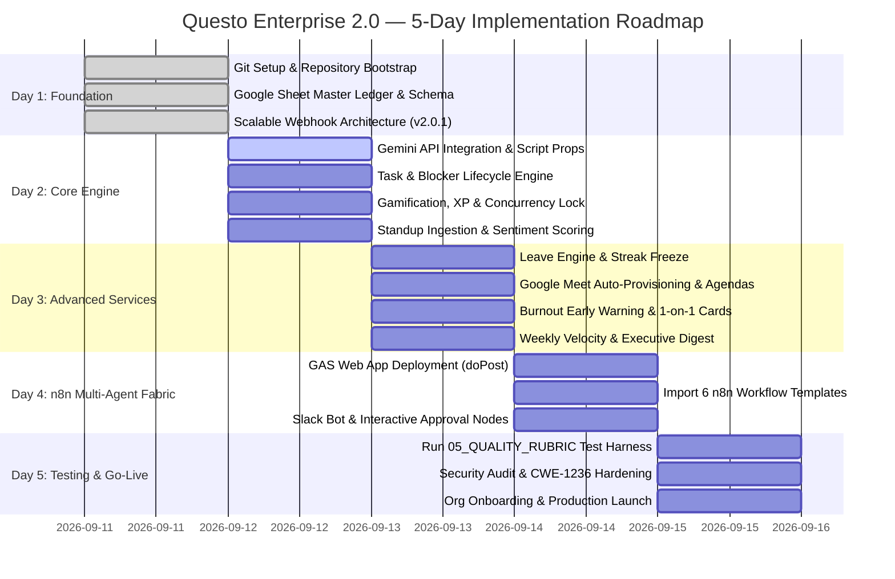

# Questo Enterprise 2.0 — 5-Day Implementation Roadmap & Execution Ledger

> [!IMPORTANT]
> **AGENT DIRECTIVE / PERSISTENT MEMORY**:
> Any AI agent reading this repository MUST inspect this document first. This document serves as the single source of truth for the 5-day implementation progress. The user does **NOT** need to repeat or recall the roadmap; the agent must inspect the **Live Phase Tracking Ledger** below to immediately resume from the exact active phase and step.

---

## 📊 Live Phase Tracking Ledger

| Day | Phase Name | Status | Key Deliverable | Verified Date |
|:---:|:---|:---:|:---|:---:|
| **Day 1** | **Foundation & Scalable Architecture Bootstrap** | 🟢 **COMPLETED** | Git CI, 8-tab Google Sheet, Scalable GAS Webhooks (v2.0.1) | 2026-09-11 |
| **Day 2** | **AI Foundation, Tasks, Standups & Gamification** | 🟡 **IN PROGRESS** | Gemini API, Task lifecycle, LockService XP, Standups | — |
| **Day 3** | **Advanced Services (Leave & Meetings)** | ⚪ *Pending* | PTO streak freeze, Google Meet agendas, Burnout AI | — |
| **Day 4** | **n8n Multi-Agent Fabric & Slack Integration** | ⚪ *Pending* | Web App deployment, 6 imported n8n workflows | — |
| **Day 5** | **Security Audit, Quality Harness & Go-Live** | ⚪ *Pending* | 05_QUALITY_RUBRIC tests, STRIDE audit, Production lock | — |

---

## 📅 Visual Gantt Implementation Timeline

---

## 🛠️ Detailed Day-by-Day Implementation Guide

### Day 1: Foundation & Spreadsheet Ledger Bootstrap
* **Status**: 🟢 **COMPLETED & PROMOTED TO PROD (`v2.0.1`)**
* **Accomplished**:
  - [x] Initialized Git with branching structure (`develop`, `staging`, `main`).
  - [x] GitHub Actions CI pipeline running with automated syntax, JSON schema, and secret leak scanning.
  - [x] Single-arrow pipeline with **CacheService Idempotency** and **LockService Concurrency** to prevent bottlenecks.
  - [x] Single-bundle Apps Script engine with glowing SVG Command Center UI.
  - [x] Promoted cleanly through `feat` $\rightarrow$ `develop` $\rightarrow$ `staging` $\rightarrow$ `main` with semantic tag `v2.0.1`.

---

### Day 2: AI Foundation, Tasks, Standups & Gamification
* **Status**: 🟡 **ACTIVE IN PROGRESS**
* **Primary Objective**: Wire Gemini API credentials, validate task lifecycle, test thread-safe XP awards, and standup risk triage.
* **Goals**:
  1. Configure Gemini 1.5 Flash / Pro API key in `PropertiesService`.
  2. Validate Task transitions (`Todo` $\rightarrow$ `Done` $\rightarrow$ `Blocked`).
  3. Validate Gamification level curves ($\lfloor\sqrt{\text{XP}/50}\rfloor + 1$).
  4. Validate Standup sentiment evaluation.
