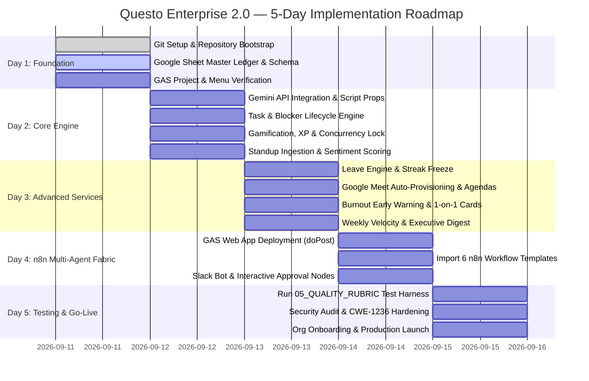

# Questo Enterprise 2.0 — 5-Day Implementation Roadmap & Execution Ledger

> [!IMPORTANT]
> **AGENT DIRECTIVE / PERSISTENT MEMORY**:
> Any AI agent reading this repository MUST inspect this document first. This document serves as the single source of truth for the 5-day implementation progress. The user does **NOT** need to repeat or recall the roadmap; the agent must inspect the **Live Phase Tracking Ledger** below to immediately resume from the exact active phase and step.

---

## 📊 Live Phase Tracking Ledger

| Day | Phase Name | Status | Key Deliverable | Verified Date |
|:---:|:---|:---:|:---|:---:|
| **Day 1** | **Foundation & Spreadsheet Ledger Bootstrap** | 🟡 **IN PROGRESS** | Git repo, 8-tab Google Sheet, GAS menu active | 2026-09-11 |
| **Day 2** | **AI Foundation, Tasks, Standups & Gamification** | ⚪ *Pending* | Gemini API, Task lifecycle, LockService XP, Standups | — |
| **Day 3** | **Advanced Services (Leave & Meetings)** | ⚪ *Pending* | PTO streak freeze, Google Meet agendas, Burnout AI | — |
| **Day 4** | **n8n Multi-Agent Fabric & Slack Integration** | ⚪ *Pending* | Web App deployment, 6 imported n8n workflows | — |
| **Day 5** | **Security Audit, Quality Harness & Go-Live** | ⚪ *Pending* | 05_QUALITY_RUBRIC tests, STRIDE audit, Production lock | — |

---

## 📅 Visual Gantt Implementation Timeline

---

## 🛠️ Detailed Day-by-Day Implementation Guide

### Day 1: Foundation & Spreadsheet Ledger Bootstrap
* **Primary Objective**: Establish version-controlled repository, initialize Google Sheet schema, and wire Google Apps Script UI.
* **Goals**:
  1. Initialize local Git repository on `main`, configure `.gitignore` (filtering `.DS_Store`, credentials, logs), and create baseline commit.
  2. Create Google Sheet named `Questo - Company Operations & Tasks` at `sheets.new`.
  3. Load Google Apps Script bundle ([questo/gas/QuestoBundle.js](file:///Users/bhargavkalambhe/Desktop/Questo/questo/gas/QuestoBundle.js)) into Apps Script editor.
  4. Run `initializeQuestoSheet()` to generate all 8 operational sheets, dropdown validations, and sample org hierarchy.
* **How We Do It**:
  - [x] Run `git init -b main`, configure `.gitignore`, commit baseline code (`9b33b5a`).
  - [x] Generate unified single-file bundle `QuestoBundle.js` for one-click Apps Script setup (`00a3413`).
  - [ ] User opens Google Sheet, pastes bundle into Apps Script editor, and runs `initializeQuestoSheet()`.
  - [ ] Verify `⚡ Questo AI 2.0` menu appears in Google Sheet upon refresh.
* **Deliverable**: Functional 8-tab operational ledger with live custom menu.

---

### Day 2: AI Foundation, Tasks, Standups & Gamification
* **Primary Objective**: Bring daily workflow automation to life with Gemini AI, task state machines, standup sentiment, and XP gamification.
* **Goals**:
  1. Configure Gemini 1.5 Flash / Pro API key in `PropertiesService` via `⚡ Questo AI 2.0 -> Configure API Keys`.
  2. Validate [gas/TaskService.js](file:///Users/bhargavkalambhe/Desktop/Questo/questo/gas/TaskService.js): task creation, status transitions (`Todo` $\rightarrow$ `In Progress` $\rightarrow$ `Done` $\rightarrow$ `Blocked`), and automatic completion timestamping.
  3. Validate [gas/GamificationService.js](file:///Users/bhargavkalambhe/Desktop/Questo/questo/gas/GamificationService.js): verify `LockService` thread safety, XP bounties, and quadratic level curve:
     $$\text{Level} = \left\lfloor \sqrt{\frac{\text{Total XP}}{50}} \right\rfloor + 1$$
  4. Validate [gas/StandupService.js](file:///Users/bhargavkalambhe/Desktop/Questo/questo/gas/StandupService.js): test standup logging, AI sentiment scoring (1-10), and consecutive streak incrementing.
* **How We Do It**:
  - Trigger `menuConfigureSettings` from the sheet menu and input the Gemini API Key.
  - Create sample quests, mark as `Done`, and assert that assignee Total XP increments and toasts trigger.
  - Submit sample standup updates and verify AI sentiment/risk columns populate accurately.
* **Deliverable**: Fully working task and standup cycle with automatic AI risk triage and real-time XP leveling.

---

### Day 3: Advanced Workflows (Leave Machine & Meeting Orchestration)
* **Primary Objective**: Implement organizational care features: student/intern streak-freezing leave management and Google Meet scheduling.
* **Goals**:
  1. Test [gas/LeaveService.js](file:///Users/bhargavkalambhe/Desktop/Questo/questo/gas/LeaveService.js): submit leave requests, verify `Streak Protected? = TRUE` (freezes streak without resetting to 0), and auto-extend task due dates by `daysCount`.
  2. Test [gas/CalendarService.js](file:///Users/bhargavkalambhe/Desktop/Questo/questo/gas/CalendarService.js): provision native Google Meet links, query attendee active blockers, and synthesize AI pre-meeting agendas.
  3. Test [gas/AnalyticsService.js](file:///Users/bhargavkalambhe/Desktop/Questo/questo/gas/AnalyticsService.js): compute Delivery Reliability %, Standup Consistency %, Burnout Risk flags (🔴, 🟡, 🟢), and generate Gemini 1-on-1 coaching cards.
  4. Test [gas/ReportService.js](file:///Users/bhargavkalambhe/Desktop/Questo/questo/gas/ReportService.js): synthesize Friday weekly velocity digests and award Weekly MVP.
* **How We Do It**:
  - Trigger `menuSubmitLeaveRequest` and approve it; verify task deadlines shift and streaks remain frozen.
  - Trigger `menuScheduleMeeting`; verify Google Meet link and 3-bullet AI agenda are added to the sheet and calendar.
  - Trigger `menuGeneratePerformanceAnalytics`; check generated 1-on-1 coaching cards.
* **Deliverable**: HR leave protection, calendar scheduling, and burnout intelligence operating inside the sheet.

---

### Day 4: n8n Multi-Agent Fabric & Slack Integration
* **Primary Objective**: Connect the Google Sheet database to external communication tools (Slack/Discord) via asynchronous n8n agents.
* **Goals**:
  1. Deploy Google Apps Script as a **Web App** (`Execute as: Me`, `Access: Anyone`) and copy the Webhook URL.
  2. Configure inbound authentication token (`X-Questo-Token`) in [gas/WebhookService.js](file:///Users/bhargavkalambhe/Desktop/Questo/questo/gas/WebhookService.js).
  3. Import the 6 n8n workflow templates from [`questo/n8n/`](file:///Users/bhargavkalambhe/Desktop/Questo/questo/n8n/):
     - Daily Standup Agent ([workflow_standup_agent.json](file:///Users/bhargavkalambhe/Desktop/Questo/questo/n8n/workflow_standup_agent.json))
     - P0 Blocker Escalation Bot ([workflow_blocker_alert.json](file:///Users/bhargavkalambhe/Desktop/Questo/questo/n8n/workflow_blocker_alert.json))
     - Interactive Slack Leave Approval ([workflow_leave_approval.json](file:///Users/bhargavkalambhe/Desktop/Questo/questo/n8n/workflow_leave_approval.json))
     - Google Meet Scheduler Bot ([workflow_meeting_scheduler.json](file:///Users/bhargavkalambhe/Desktop/Questo/questo/n8n/workflow_meeting_scheduler.json))
     - Meeting Transcript Extractor ([workflow_meeting_parser.json](file:///Users/bhargavkalambhe/Desktop/Questo/questo/n8n/workflow_meeting_parser.json))
     - Weekly Executive Digest Cron ([workflow_weekly_digest.json](file:///Users/bhargavkalambhe/Desktop/Questo/questo/n8n/workflow_weekly_digest.json))
  4. Wire Slack incoming webhooks and channel routing (`#incident-ops`, `#standups`, `#general`).
* **How We Do It**:
  - In n8n, create credentials for Gemini and Slack.
  - Import each workflow JSON file.
  - Replace `YOUR_QUESTO_APP_ID` with the deployed Apps Script Web App URL.
  - Execute end-to-end test payload from Slack to Sheet and back.
* **Deliverable**: Automated bidirectional communication between team chats, n8n agents, and Google Sheets.

---

### Day 5: Security Audit, Quality Harness & Production Go-Live
* **Primary Objective**: Harden the system against vulnerabilities, verify against quality rubric, and launch to the organization.
* **Goals**:
  1. Run the 4 verification test scenarios from [05_QUALITY_RUBRIC.md](file:///Users/bhargavkalambhe/Desktop/Questo/questo/05_QUALITY_RUBRIC.md).
  2. Complete STRIDE threat audit from [04_SECURITY_CVE.md](file:///Users/bhargavkalambhe/Desktop/Questo/questo/04_SECURITY_CVE.md) (CWE-1236 Formula Injection sanitization, token secrecy).
  3. Conduct role-based walkthrough for CEO, CTO, Leads, Engineers, and Interns.
  4. Configure Google Sheets Range Protections (locking formulas and XP columns from unauthorized edits).
* **How We Do It**:
  - Execute test cases: bootstrap, blocker escalation, XP level-up, transcript extraction.
  - Verify formula sanitization against `=, +, -, @` inputs.
  - Set sheet permissions so contributors can only edit assigned columns.
* **Deliverable**: Hardened, production-ready Questo Enterprise 2.0 platform.

---

## 🧠 Protocol for Future AI Agents

Whenever a new AI agent or session starts:
1. **First step**: Read this file (`questo/00_5_DAY_ROADMAP.md`).
2. **Check the Live Phase Tracking Ledger**: Identify which day is marked `IN PROGRESS`.
3. **Do not re-ask the user** what the plan is or what needs to be done. Greet the user with:
   > "Resuming Questo Enterprise 2.0 execution from [Day X: Phase Name]. Here is our current checklist..."
4. **Update this ledger**: As each milestone completes, change the status badge in the table and commit to Git.
