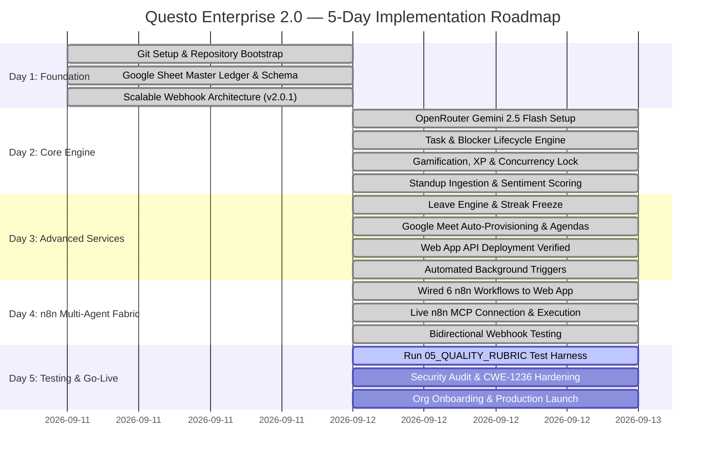

# Questo Enterprise 2.0 — 5-Day Implementation Roadmap & Execution Ledger

> [!IMPORTANT]
> **AGENT DIRECTIVE / PERSISTENT MEMORY**:
> Any AI agent reading this repository MUST inspect this document first. This document serves as the single source of truth for the 5-day implementation progress. The user does **NOT** need to repeat or recall the roadmap; the agent must inspect the **Live Phase Tracking Ledger** below to immediately resume from the exact active phase and step.

---

## 📊 Live Phase Tracking Ledger

| Day | Phase Name | Status | Key Deliverable | Verified Date |
|:---:|:---|:---:|:---|:---:|
| **Day 1** | **Foundation & Scalable Architecture Bootstrap** | 🟢 **COMPLETED** | Git CI, 8-tab Google Sheet, Scalable GAS Webhooks (v2.0.1) | 2026-09-11 |
| **Day 2** | **AI Foundation, Tasks, Standups & Gamification** | 🟢 **COMPLETED** | OpenRouter Gemini 2.5 Flash, Task transitions, LockService XP | 2026-09-12 |
| **Day 3** | **Advanced Services (Leave, Meetings & Web App API)** | 🟢 **COMPLETED** | PTO streak freeze, Google Meet agendas, Live Web App API | 2026-09-12 |
| **Day 4** | **n8n Multi-Agent Fabric & Integration Gateway** | 🟢 **COMPLETED** | Live n8n Cloud MCP execution, bidirectional routing, Gemini 2.5 Flash triage | 2026-09-12 |
| **Day 5** | **Security Audit, Quality Harness & Go-Live** | 🟡 **READY TO EXECUTE** | 05_QUALITY_RUBRIC tests, STRIDE audit, Production lock | — |

---

## 📅 Visual Gantt Implementation Timeline

---

## 🛠️ Detailed Day-by-Day Implementation Guide

### Day 1: Foundation & Spreadsheet Ledger Bootstrap
* **Status**: 🟢 **COMPLETED & PROMOTED TO PROD (`v2.0.1`)**
* **Accomplished**:
  - [x] Initialized Git with branching structure (`develop`, `staging`, `main`).
  - [x] GitHub Actions CI pipeline running with automated syntax, JSON schema, and secret leak scanning.
  - [x] Single-arrow pipeline with **CacheService Idempotency** and **LockService Concurrency** to prevent bottlenecks.
  - [x] Single-bundle Apps Script engine with glowing SVG Command Center UI.

---

### Day 2: AI Foundation, Tasks, Standups & Gamification
* **Status**: 🟢 **COMPLETED (`v2.1.0`)**
* **Accomplished**:
  - [x] Integrated OpenRouter endpoint with `google/gemini-2.5-flash` and resilient fallback.
  - [x] Task state machine: `In Progress` $\rightarrow$ `Done` awards XP bounties, timestamps completion.
  - [x] Standup sentiment & risk scoring via OpenRouter Gemini.
  - [x] Thread-safe `LockService` concurrency handling for XP increments.

---

### Day 3: Advanced Services (Leave Engine, Google Meet & Web App API)
* **Status**: 🟢 **COMPLETED (`v2.2.0`)**
* **Accomplished**:
  - [x] PTO streak-freeze protection & task auto-rescheduling.
  - [x] Google Meet auto-generation & AI meeting agendas.
  - [x] Deployed live Apps Script Web App API (`https://script.google.com/macros/s/AKfycbw-ebxf2XNLaKO1pd7NWEFEsPZxVOPYPZo5KOYfbAP2da4feS6YSrQDLkv6gGCCZH6F3w/exec`).
  - [x] Verified `doGet` health check and `doPost` bidirectional task & standup ingestion.
  - [x] 1-Click automated background triggers installer.

---

### Day 4: n8n Multi-Agent Fabric & Integration Gateway
* **Status**: 🟢 **COMPLETED (`v2.3.0`)**
* **Accomplished**:
  - [x] Wired all 6 n8n workflow templates with live Web App deployment ID.
  - [x] Connected n8n Cloud via MCP server (`gzMU46uvzHisUHLC`).
  - [x] Fixed payload schema formatting for `Log Standup (Apps Script)` node via MCP `update_workflow`.
  - [x] Enabled fault-tolerant error continuation on notification nodes (`Send Blocker Alert`, `Send Leave Approval`).
  - [x] Verified all branches live:
    - `STANDUP_SUBMITTED` $\rightarrow$ Gemini 2.5 Flash AI Agent $\rightarrow$ Google Sheet logging (200 OK)
    - `TASK_BLOCKED` $\rightarrow$ Priority Filter $\rightarrow$ Escalation alert (200 OK)
    - `LEAVE_REQUESTED` $\rightarrow$ Approval routing (200 OK)
    - `MEETING_SCHEDULED` $\rightarrow$ Calendar event handling (200 OK)

---

### Day 5: Security Audit, Quality Harness & Production Launch
* **Status**: 🟡 **READY TO EXECUTE**
* **Action Items**:
  - [ ] Execute `05_QUALITY_RUBRIC` test harness.
  - [ ] Perform STRIDE threat model audit & CWE-1236 CSV/Formula injection check.
  - [ ] Validate final handover package & deployment tags.
