# Questo Enterprise System Architecture (01_ARCHITECTURE.md)

## 1. Executive Summary & Vision
**Questo Enterprise 2.0** is an AI-orchestrated company operations, employee task, and performance intelligence platform. It transforms standard Google Sheets into an enterprise operational database, backed by Google Apps Script (GAS) event triggers and an n8n multi-agent workflow fabric. 

Questo coordinates the complete organizational pipeline: **CEO $\rightarrow$ CTO $\rightarrow$ Team Leads $\rightarrow$ Engineers $\rightarrow$ Interns / Students**, integrating automated Google Meet scheduling, student/intern leave initiation with streak-freezing protection, task rescheduling, and continuous AI performance & burnout analytics.

---

## 2. Global Topology & Component Boundaries

```mermaid
flowchart TD
    subgraph INGESTION ["1. Ingestion & Interaction Tier"]
        GSheet["Google Sheets UI (Master Ledger - 8 Tabs)"]
        SlackBot["Slack / Discord Interactive Bots"]
        GCalendar["Google Calendar & Meet Conference API"]
        MeetingAudio["Meeting Transcripts (Meet / Zoom / Otter)"]
        GASMenu["Custom Menu ('⚡ Questo AI 2.0')"]
    end

    subgraph GAS_EDGE ["2. Google Apps Script Edge Layer"]
        MenuRouter["UI Menu & Modal Dialog Router"]
        EditTriggers["Simple & Installable onEdit Triggers"]
        CalendarService["CalendarService (Google Meet Auto-Provisioning)"]
        LeaveService["LeaveService (PTO State Machine & Streak Freeze)"]
        AnalyticsService["AnalyticsService (Reliability & Burnout Analytics)"]
        GamifySub["Gamification & Level Math Engine"]
        RESTGateway["doPost(e) / doGet(e) Webhook API"]
        LocalAI["Direct AI Connector (UrlFetchApp -> Gemini/OpenAI)"]
    end

    subgraph N8N_FABRIC ["3. n8n Multi-Agent Workflow Fabric"]
        N8NRouter["Webhook Ingestion Router"]
        StandupAgent["Daily Standup & Blocker Agent"]
        MeetingAgent["Transcript & Action Item Extractor"]
        SchedulerAgent["Smart Meeting Scheduler & Pre-Meeting Briefing Bot"]
        LeaveAgent["Interactive Slack Leave Approval Bot"]
        EscalationAgent["P0/P1 Blocker Incident Bot"]
        WeeklyAgent["Weekly Executive Synthesis Cron"]
    end

    subgraph AI_FOUNDATION ["4. Foundation LLM APIs"]
        GeminiFlash["Google Gemini 1.5 Flash (Triage & Agendas)"]
        GeminiPro["Google Gemini 1.5 Pro / GPT-4o (1-on-1 Reviews & Summaries)"]
    end

    subgraph PERSISTENCE ["5. Relational Google Sheets Model (8 Tabs)"]
        T_Tasks["📋 Tasks & Quests"]
        T_Standups["⏱️ Daily Standups"]
        T_Employees["🏆 Employees & Org Hierarchy"]
        T_Leave["🏖️ Leave & PTO Management"]
        T_Meetings["📅 Scheduled Meetings & Meet Links"]
        T_Analytics["📈 Performance & Health Analytics"]
        T_Notes["🎙️ Meeting Notes & Actions"]
        T_Weekly["📊 Weekly Summaries"]
        T_Config["⚙️ Config & Prompts"]
    end

    %% Ingestion connections
    GSheet --> GASMenu --> MenuRouter
    GSheet --> EditTriggers
    EditTriggers --> GamifySub --> T_Employees
    EditTriggers -->|JSON Event Payload| N8NRouter
    LocalAI <--> GeminiFlash
    GCalendar <--> CalendarService

    SlackBot --> N8NRouter
    MeetingAudio --> N8NRouter

    N8NRouter --> StandupAgent
    N8NRouter --> MeetingAgent
    N8NRouter --> SchedulerAgent
    N8NRouter --> LeaveAgent
    N8NRouter --> EscalationAgent
    N8NRouter --> WeeklyAgent

    StandupAgent <--> GeminiFlash
    MeetingAgent <--> GeminiFlash
    SchedulerAgent <--> GeminiFlash
    EscalationAgent --> SlackBot
    WeeklyAgent <--> GeminiPro
    AnalyticsService <--> GeminiPro

    StandupAgent -->|Update Rows via GAS REST API| RESTGateway
    MeetingAgent -->|Append Extracted Quests| RESTGateway
    SchedulerAgent -->|Schedule Event & Return Meet Link| RESTGateway
    LeaveAgent -->|Freeze Streak & Reschedule Tasks| RESTGateway
    WeeklyAgent -->|Write Weekly Executive Report| RESTGateway

    RESTGateway --> T_Tasks
    RESTGateway --> T_Standups
    RESTGateway --> T_Leave
    RESTGateway --> T_Meetings
    RESTGateway --> T_Analytics
    RESTGateway --> T_Weekly
    T_Config -.-> MenuRouter
```



---

## 3. Communication Protocols & Contracts

### 3.1 Leave Ingestion & Approval Contract
When a student or employee submits a leave request, an event is sent to n8n:
```json
{
  "event": "LEAVE_REQUESTED",
  "timestamp": "2026-09-10T17:30:00.000Z",
  "sheetId": "1a2b3c4d5e6f7g8h9i0",
  "payload": {
    "leaveId": "LVE-5001",
    "employeeEmail": "intern@company.com",
    "roleTier": "Intern / Student",
    "approverEmail": "sarah@company.com",
    "leaveType": "Exam / Study Leave",
    "startDate": "2026-09-18",
    "endDate": "2026-09-21",
    "daysCount": 4,
    "reason": "Semester exams for Distributed Systems"
  }
}
```

When approved by the manager via Slack:
```json
{
  "action": "APPROVE_LEAVE",
  "token": "questo_secret_token_123",
  "data": {
    "leaveId": "LVE-5001",
    "remarks": "Approved by Sarah Chen. Standup streak frozen and deadlines extended."
  }
}
```

### 3.2 Automated Meeting Scheduling Contract
```json
{
  "action": "SCHEDULE_MEETING",
  "token": "questo_secret_token_123",
  "data": {
    "title": "AI Intern Mentorship & Eval Sync",
    "meetingType": "1-on-1 Mentorship",
    "host": "sarah@company.com",
    "attendees": "intern@company.com, sarah@company.com",
    "startTime": "2026-09-11T14:00:00Z",
    "endTime": "2026-09-11T14:30:00Z"
  }
}
```

Response from Questo:
```json
{
  "status": "success",
  "meeting": {
    "meetingId": "MTG-6001",
    "meetLink": "https://meet.google.com/qst-abc-def",
    "agenda": "1. Review ScaNN benchmark findings\n2. Discuss reranking latency\n3. Pre-exam leave handover"
  }
}
```
